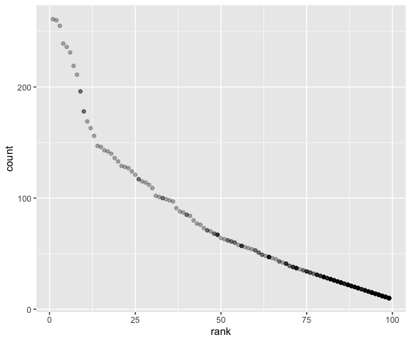

p8105\_hw2\_cx2227
================
Chuyue Xiang
10/1/2019

## Problem 1

### Part 1: Read and clean the Mr. Trash Wheel sheet

``` r
trashwheel = read_excel("Trash-Wheel-Collection-Totals-8-6-19.xlsx", sheet = "Mr. Trash Wheel",
                        range = "A2:N406", na = "") %>%
  janitor::clean_names() %>%
  na.omit() %>% 
  mutate(sports_balls = as.integer(round(sports_balls, 0)))
```

### Part 2: Read and clean precipitation data for 2017 and 2018

#### Read and clean 2017 precipitation data

``` r
precip_2017 = read_excel("Trash-Wheel-Collection-Totals-8-6-19.xlsx", sheet = "2017 Precipitation", 
                         range = "A2:B14", na = "" ) %>%
  mutate(year = 2017)
```

#### Read and clean 2018 precipitation data

``` r
precip_2018 = read_excel("Trash-Wheel-Collection-Totals-8-6-19.xlsx", sheet = "2018 Precipitation", 
                         range = "A2:B14", na = "" ) %>%
  mutate (year = 2018)
```

#### Combine 2017 and 2018 data

``` r
combine_precip = left_join(precip_2017, precip_2018, by = "Month") %>%
  mutate(Month = month.name)
```

### Part 3: Paragraph

  - The trashwheel dataset has 344 observations and the combined
    precipitation table has 12 obeservations.
  - The key variable of the trashwheel dataset is variable
    “sports\_balls”, and the key variable fo the combined
    precipitation table is variable total precipitation amount.
  - The total precipitation in 2018 is 70.33 (in).
  - The median number of sports balls in a dumpster in 2017 is 8

## Problem 2

### Part 1: Clean the data in pols-month.csv.

``` r
pols_month = read_csv("./fivethirtyeight_datasets/pols-month.csv") %>%
  separate(col = mon, into = c("year","month","day")) %>%
  mutate(month = recode(month, "01" = "January", "02" = "February", "03" = "March", "04" = "April",
                        "05" = "May", "06" = "June", "07" = "July", "08" = "August", "09" = "September",
                        "10" = "October", "11" = "November", "12" = "December")) %>% 
  select(prez_gop, prez_dem, everything()) %>%
  pivot_longer(prez_gop:prez_dem, names_to = "president", names_prefix = "prez_") %>% 
  filter(value != 0) %>% 
  select(-day) %>%
  select(-value)
```

### Part 2: Clean the data in snp.csv.

``` r
snp = read_csv("./fivethirtyeight_datasets/snp.csv") %>% 
  separate(col = date, into = c("month","day","year")) %>% 
  arrange(as.integer(year), as.integer(month)) %>% 
  select(year, month, close) %>% 
  mutate(month = recode(month, "1" = "January", "2" = "February", "3" = "March", "4" = "April",
                        "5" = "May", "6" = "June", "7" = "July", "8" = "August", "9" = "September",
                        "10" = "October", "11" = "November", "12" = "December"))
```

### Part 3: Tidy the unemployment data.

``` r
unemployment = read_csv("./fivethirtyeight_datasets/unemployment.csv") %>% 
  pivot_longer(Jan:Dec, names_to = "month", values_to = "value") %>% 
  mutate(month = recode(month, "Jan" = "January", "Feb" = "February", "Mar" = "March", "Apr" = "April",
                        "May" = "May", "Jun" = "June", "Jul" = "July", "Aug" = "August", "Sep" = "September","Oct" = "October", "Nov" = "November", "Dec" = "December")) %>%
  mutate(Year = as.character(Year)) %>% 
  select(year = Year, everything())
```

### Part 4: Join the datasets

``` r
pols_snp = full_join(pols_month, snp, by = c("year","month"))
pols_snp_unem = full_join(pols_snp, unemployment, by = c("year","month"))
```

### Part 5: Explaination

  - The `pols_month` dataset contains the number of different kinds of
    government staff and also the time of the data.
  - The `snp` dataset has the closing values with different dates.
  - The `unemployment` dataset contains the percentage of unemployment
    and the time data.
  - The combined dataset `pols_snp_unem` has 828 observations from 1947
    to 2015.
  - Key variables are `close` and `value`.

## Problem 3

### Part 1: Load and tidy the data

``` r
pop_baby = read_csv("Popular_Baby_Names.csv") %>% 
  janitor::clean_names() %>% 
  mutate(gender = str_to_upper(gender), ethnicity = str_to_upper(ethnicity),
         childs_first_name = str_to_upper(childs_first_name)) %>% 
  mutate(ethnicity = recode(ethnicity, "ASIAN AND PACI" = "ASIAN AND PACIFIC ISLANDER",
                            "BLACK NON HISP" = "BLACK NON HISPANIC",
                            "WHITE NON HISP" = "WHITE NON HISPANIC")) %>% 
  distinct()
```

### Part 2: Olivia table

``` r
olivia = filter(pop_baby, gender == "FEMALE", childs_first_name == "OLIVIA") %>% 
  select(-gender, -childs_first_name, -count) %>%
  arrange(ethnicity, year_of_birth) %>% 
  pivot_wider(names_from = year_of_birth, values_from = rank) %>% 
  knitr::kable()
olivia
```

| ethnicity                  | 2011 | 2012 | 2013 | 2014 | 2015 | 2016 |
| :------------------------- | ---: | ---: | ---: | ---: | ---: | ---: |
| ASIAN AND PACIFIC ISLANDER |    4 |    3 |    3 |    1 |    1 |    1 |
| BLACK NON HISPANIC         |   10 |    8 |    6 |    8 |    4 |    8 |
| HISPANIC                   |   18 |   22 |   22 |   16 |   16 |   13 |
| WHITE NON HISPANIC         |    2 |    4 |    1 |    1 |    1 |    1 |

### Part 3: Popular Male table

``` r
popular_male = filter(pop_baby, gender == "MALE", rank == 1) %>%
  select(-gender, -rank, -count) %>% 
  arrange(ethnicity, year_of_birth, childs_first_name) %>% 
  pivot_wider(names_from = year_of_birth, values_from = childs_first_name) %>%
  knitr::kable()
popular_male
```

| ethnicity                  | 2011    | 2012   | 2013   | 2014   | 2015   | 2016   |
| :------------------------- | :------ | :----- | :----- | :----- | :----- | :----- |
| ASIAN AND PACIFIC ISLANDER | ETHAN   | RYAN   | JAYDEN | JAYDEN | JAYDEN | ETHAN  |
| BLACK NON HISPANIC         | JAYDEN  | JAYDEN | ETHAN  | ETHAN  | NOAH   | NOAH   |
| HISPANIC                   | JAYDEN  | JAYDEN | JAYDEN | LIAM   | LIAM   | LIAM   |
| WHITE NON HISPANIC         | MICHAEL | JOSEPH | DAVID  | JOSEPH | DAVID  | JOSEPH |

### Part 4: Scatter plot

``` r
filter(pop_baby, gender == "MALE", ethnicity == "WHITE NON HISPANIC", year_of_birth == 2016) %>% 
  ggplot(aes(x = rank, y = count)) + 
  geom_point(alpha = 0.3)
```

<!-- -->
